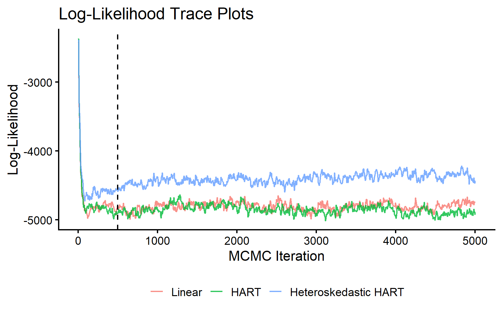
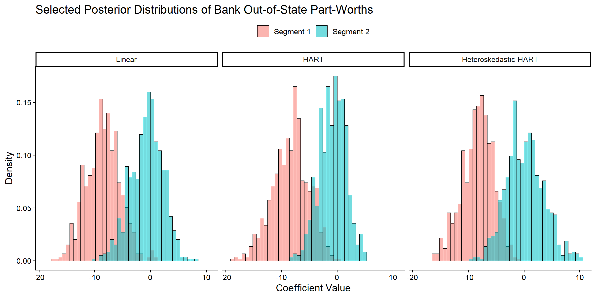
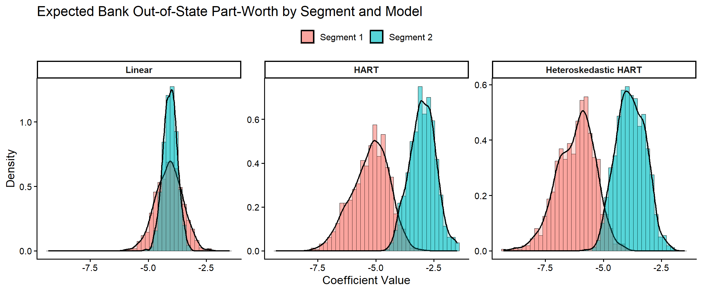
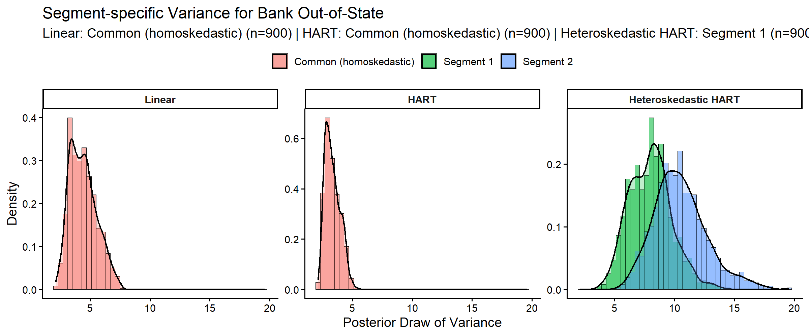
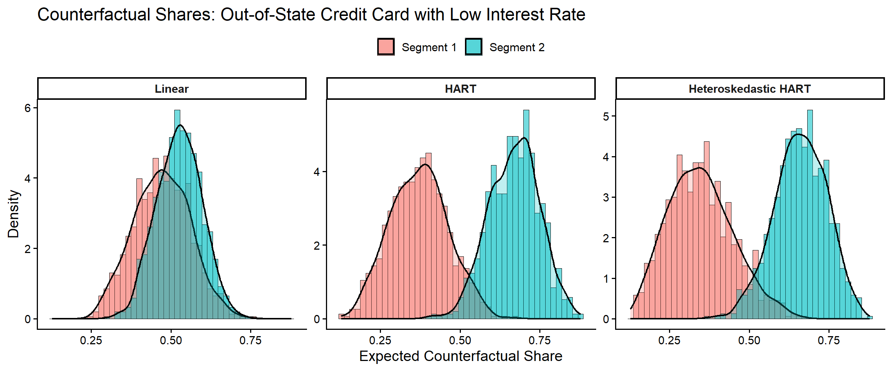
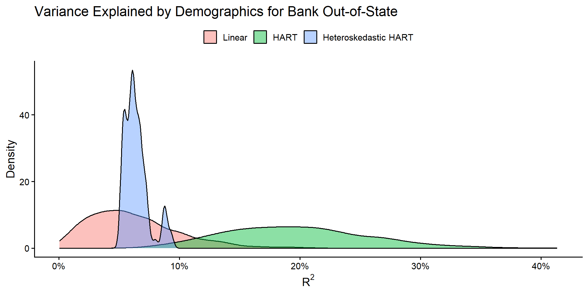
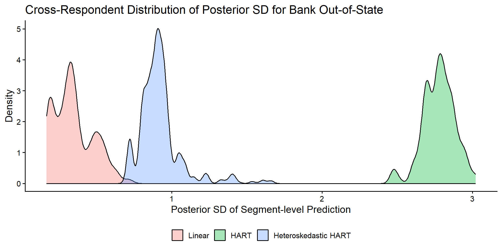

## Introduction

This vignette extends the standard `bank` example to a three-model comparison:

1. Linear hierarchical MNL (`Delta' Z`)
2. HART mean model (`Delta(Z)`)
3. Heteroskedastic HART (`Delta(Z)` and `Sigma(Z)`)

The first two models differ in how they model the representative consumer. The third model additionally allows the covariance of unobserved heterogeneity to vary with demographics through tree models on the modified-Cholesky components.

## Conjoint Data of Allenby and Ginter (1995)


```r
# Load dependencies
library(bayesm.HART)
library(bayesm)
library(tidyr)
library(dplyr)
library(ggplot2)

# Load and prepare bank data
data(bank)
choiceAtt <- bank$choiceAtt
hh <- levels(factor(choiceAtt$id))
nhh <- length(hh)
lgtdata <- vector("list", length = nhh)
for (i in 1:nhh) {
  y <- 2 - choiceAtt[choiceAtt[, 1] == hh[i], 2]
  X_temp <- as.matrix(choiceAtt[choiceAtt[, 1] == hh[i], c(3:16)])
  X <- matrix(0, nrow = nrow(X_temp) * 2, ncol = ncol(X_temp))
  X[seq(1, nrow(X), by = 2), ] <- X_temp
  lgtdata[[i]] <- list(y = y, X = X)
}
Z <- as.matrix(bank$demo[, -1]) # omit id
Z <- t(t(Z) - colMeans(Z))      # centered Z as required by rhier*

Data <- list(lgtdata = lgtdata, Z = Z, p = 2)
```

## MCMC Estimation: Three Models


```r
# MCMC parameters
R <- 5000
burn <- 500
keep <- 5
Mcmc <- list(R = R, keep = keep)
model_cache_file <- file.path(
  vignette_cache_dir,
  sprintf("bank-heteroskedastic-models-nodart-R%s-keep%s.rds", R, keep)
)

model_cache_ok <- FALSE
if (file.exists(model_cache_file)) {
  model_cache <- tryCatch(readRDS(model_cache_file), error = function(e) NULL)
  model_cache_ok <- !is.null(model_cache) &&
    is.list(model_cache) &&
    !is.null(model_cache$out_lin) &&
    !is.null(model_cache$out_hart) &&
    !is.null(model_cache$out_heter)
  if (model_cache_ok) {
    out_lin <- model_cache$out_lin
    out_hart <- model_cache$out_hart
    out_heter <- model_cache$out_heter
    # Restore S3 class vectors lost by saveRDS/readRDS
    class(out_lin) <- "rhierMnlRwMixture"
    class(out_hart) <- "rhierMnlRwMixture"
    class(out_heter) <- c("rhierMnlRwMixtureHeterCov",
                           "bayesm.HART.HeterCov",
                           "rhierMnlRwMixture")
    cat("Loaded cached model draws from:", model_cache_file, "\n")
  }
}

if (!model_cache_ok) {
  # (1) Linear hierarchical MNL
  out_lin <- bayesm.HART::rhierMnlRwMixture(
    Data = Data, Mcmc = Mcmc,
    Prior = list(ncomp = 1),
    r_verbose = FALSE
  )

  # (2) HART mean model
  out_hart <- bayesm.HART::rhierMnlRwMixture(
    Data = Data, Mcmc = Mcmc,
    Prior = list(
      ncomp = 1,
      bart = list(num_trees = 20, sparse = FALSE)
    ),
    r_verbose = FALSE
  )

  # (3) HART mean + heteroscedastic covariance Sigma(Z)
  out_heter <- bayesm.HART::rhierMnlRwMixture(
    Data = Data, Mcmc = Mcmc,
    Prior = list(
      ncomp = 1,
      bart = list(num_trees = 20, sparse = FALSE),
      vartree = list(num_trees = 20, sparse = FALSE),
      phitree = list(num_trees = 20, sparse = FALSE)
    ),
    r_verbose = FALSE
  )

  saveRDS(
    list(
      out_lin = out_lin,
      out_hart = out_hart,
      out_heter = out_heter,
      generated_at = Sys.time()
    ),
    model_cache_file
  )
  cat("Saved model draws cache to:", model_cache_file, "\n")
}
```

We first compare log-likelihood traces for all three models.


```r
burnin_draws <- ceiling(burn / keep)

mcmc_data <- data.frame(
  Iteration = (1:length(out_lin$loglike)) * keep,
  Linear = out_lin$loglike,
  HART = out_hart$loglike,
  HeteroskedasticHART = out_heter$loglike
) %>%
  pivot_longer(
    cols = c("Linear", "HART", "HeteroskedasticHART"),
    names_to = "Model",
    values_to = "LogLikelihood"
  ) %>%
  mutate(
    Model = recode(Model, HeteroskedasticHART = "Heteroskedastic HART"),
    Model = factor(Model, levels = c("Linear", "HART", "Heteroskedastic HART"))
  )

ggplot(mcmc_data, aes(x = Iteration, y = LogLikelihood, color = Model)) +
  geom_line(alpha = 0.8) +
  geom_vline(xintercept = burn, linetype = "dashed", color = "black") +
  theme_classic(base_size = 16) +
  labs(title = "Log-Likelihood Trace Plots", x = "MCMC Iteration", y = "Log-Likelihood") +
  theme(legend.title = element_blank(), legend.position = "bottom")
```

<div class="figure" style="text-align: center">

<p class="caption">MCMC traceplot of log-likelihood across linear, HART mean, and heteroskedastic HART models.</p>
</div>

## Respondent-level Part-Worths

Following the discussion in Wiemann (2025), we examine two consumer segments defined by their demographics:

- **Segment 1** (respondent 146): older women with low income
- **Segment 2** (respondent 580): middle-aged men with moderate income

We focus on one focal coefficient: `Bank Out-of-State`.


```r
selected_resp <- c(146, 580)
coef_indx <- 10
coef_name <- colnames(bank$choiceAtt[, 3:16])[coef_indx]
coef_label <- "Bank Out-of-State"
if (!grepl("out", tolower(coef_name)) || !grepl("state", tolower(coef_name))) {
  coef_label <- coef_name
}

beta_draws <- bind_rows(
  as.data.frame(t(out_lin$betadraw[selected_resp, coef_indx, -c(1:burnin_draws)])) %>%
    mutate(Model = "Linear", Draw = row_number()),
  as.data.frame(t(out_hart$betadraw[selected_resp, coef_indx, -c(1:burnin_draws)])) %>%
    mutate(Model = "HART", Draw = row_number()),
  as.data.frame(t(out_heter$betadraw[selected_resp, coef_indx, -c(1:burnin_draws)])) %>%
    mutate(Model = "Heteroskedastic HART", Draw = row_number())
) %>%
  mutate(Model = factor(Model, levels = c("Linear", "HART", "Heteroskedastic HART")))
colnames(beta_draws)[1:2] <- paste("Segment", 1:2)

beta_draws_long <- beta_draws %>%
  pivot_longer(cols = starts_with("Segment"), names_to = "Segment", values_to = "Coefficient")

ggplot(beta_draws_long, aes(x = Coefficient, fill = Segment)) +
  geom_histogram(aes(y = after_stat(density)), bins = 45, alpha = 0.55,
                 position = "identity", color = "black", linewidth = 0.2) +
  facet_wrap(~Model, ncol = 3) +
  theme_classic(base_size = 14) +
  labs(
    title = paste("Selected Posterior Distributions of", coef_label, "Part-Worths"),
    x = "Coefficient Value",
    y = "Density"
  ) +
  theme(legend.position = "top", legend.title = element_blank())
```

<div class="figure" style="text-align: center">

<p class="caption">Posterior distributions of respondent-level out-of-state part-worths for two respondents across three models.</p>
</div>

## Segment-level Out-of-State Effects

Before moving to segment-share implications, we focus on one coefficient:
the expected part-worth for `Bank Out-of-State` in the two selected segments.


```r
# Predict only for the two highlighted segments to keep memory use modest.
Data_seg <- list(Z = Z[selected_resp, , drop = FALSE])
segment_cache_file <- file.path(
  vignette_cache_dir,
  sprintf(
    "bank-heteroskedastic-segment-nodart-resp-%s-coef-%s-burndraws-%s.rds",
    paste(selected_resp, collapse = "-"),
    coef_indx,
    burnin_draws
  )
)

segment_cache_ok <- FALSE
if (file.exists(segment_cache_file)) {
  segment_cache <- tryCatch(readRDS(segment_cache_file), error = function(e) NULL)
  segment_cache_ok <- !is.null(segment_cache) &&
    is.array(segment_cache$DeltaZ_heter) &&
    is.array(segment_cache$SigmaZ_heter) &&
    length(dim(segment_cache$SigmaZ_heter)) == 4
  if (segment_cache_ok) {
    DeltaZ_lin   <- segment_cache$DeltaZ_lin
    DeltaZ_hart  <- segment_cache$DeltaZ_hart
    DeltaZ_heter <- segment_cache$DeltaZ_heter
    SigmaZ_heter <- segment_cache$SigmaZ_heter
    cat("Loaded cached segment draws from:", segment_cache_file, "\n")
  }
}

if (!segment_cache_ok) {
  DeltaZ_lin <- predict(
    out_lin, newdata = Data_seg, type = "DeltaZ+mu", burn = burnin_draws, r_verbose = FALSE
  )
  DeltaZ_hart <- predict(
    out_hart, newdata = Data_seg, type = "DeltaZ+mu", burn = burnin_draws, r_verbose = FALSE
  )
  DeltaZ_heter <- predict(
    out_heter, newdata = Data_seg, type = "DeltaZ+mu", burn = burnin_draws, r_verbose = FALSE
  )
  SigmaZ_heter <- predict(
    out_heter, newdata = Data_seg, type = "SigmaZ", burn = burnin_draws, r_verbose = FALSE
  )
  saveRDS(
    list(
      DeltaZ_lin = DeltaZ_lin,
      DeltaZ_hart = DeltaZ_hart,
      DeltaZ_heter = DeltaZ_heter,
      SigmaZ_heter = SigmaZ_heter,
      selected_resp = selected_resp,
      coef_indx = coef_indx,
      burnin_draws = burnin_draws,
      generated_at = Sys.time()
    ),
    segment_cache_file
  )
  cat("Saved segment draws cache to:", segment_cache_file, "\n")
}
```


```r
segment_coef_df <- bind_rows(
  data.frame(
    Model = "Linear",
    Segment = "Segment 1",
    Coefficient = DeltaZ_lin[1, coef_indx, ]
  ),
  data.frame(
    Model = "Linear",
    Segment = "Segment 2",
    Coefficient = DeltaZ_lin[2, coef_indx, ]
  ),
  data.frame(
    Model = "HART",
    Segment = "Segment 1",
    Coefficient = DeltaZ_hart[1, coef_indx, ]
  ),
  data.frame(
    Model = "HART",
    Segment = "Segment 2",
    Coefficient = DeltaZ_hart[2, coef_indx, ]
  ),
  data.frame(
    Model = "Heteroskedastic HART",
    Segment = "Segment 1",
    Coefficient = DeltaZ_heter[1, coef_indx, ]
  ),
  data.frame(
    Model = "Heteroskedastic HART",
    Segment = "Segment 2",
    Coefficient = DeltaZ_heter[2, coef_indx, ]
  )
) %>%
  mutate(
    Model = factor(Model, levels = c("Linear", "HART", "Heteroskedastic HART")),
    Segment = factor(Segment, levels = c("Segment 1", "Segment 2"))
  )

ggplot(segment_coef_df, aes(x = Coefficient, fill = Segment)) +
  geom_histogram(
    aes(y = after_stat(density)),
    bins = 45,
    alpha = 0.55,
    position = "identity",
    color = "black",
    linewidth = 0.2
  ) +
  geom_density(alpha = 0.25, linewidth = 0.8) +
  facet_wrap(~Model, ncol = 3, scales = "free_y") +
  theme_classic(base_size = 14) +
  labs(
    title = paste("Expected", coef_label, "Part-Worth by Segment and Model"),
    x = "Coefficient Value",
    y = "Density"
  ) +
  theme(
    legend.position = "top",
    legend.title = element_blank(),
    strip.text = element_text(face = "bold")
  )
```

<div class="figure" style="text-align: center">

<p class="caption">Posterior distributions of segment-level expected out-of-state part-worths across linear, HART, and heteroskedastic HART models.</p>
</div>


```r
coef_summary <- segment_coef_df %>%
  group_by(Model, Segment) %>%
  summarise(
    Mean = mean(Coefficient),
    Median = median(Coefficient),
    P05 = quantile(Coefficient, 0.05),
    P95 = quantile(Coefficient, 0.95),
    .groups = "drop"
  )
print(coef_summary, digits = 3)
#> # A tibble: 6 × 6
#>   Model                Segment    Mean Median   P05   P95
#>   <fct>                <fct>     <dbl>  <dbl> <dbl> <dbl>
#> 1 Linear               Segment 1 -4.11  -4.09 -5.05 -3.17
#> 2 Linear               Segment 2 -4.06  -4.05 -4.55 -3.57
#> 3 HART                 Segment 1 -5.25  -5.16 -6.68 -4.06
#> 4 HART                 Segment 2 -2.99  -2.98 -3.95 -2.11
#> 5 Heteroskedastic HART Segment 1 -6.19  -6.09 -7.58 -4.95
#> 6 Heteroskedastic HART Segment 2 -3.82  -3.84 -4.85 -2.82

coef_diff_lin <- DeltaZ_lin[2, coef_indx, ] - DeltaZ_lin[1, coef_indx, ]
coef_diff_hart <- DeltaZ_hart[2, coef_indx, ] - DeltaZ_hart[1, coef_indx, ]
coef_diff_heter <- DeltaZ_heter[2, coef_indx, ] - DeltaZ_heter[1, coef_indx, ]
cat("Pr(Expected part-worth Segment 2 > Segment 1):\n")
#> Pr(Expected part-worth Segment 2 > Segment 1):
cat("  Linear =", round(mean(coef_diff_lin > 0), 3), "\n")
#>   Linear = 0.522
cat("  HART =", round(mean(coef_diff_hart > 0), 3), "\n")
#>   HART = 0.991
cat("  Heteroskedastic HART =", round(mean(coef_diff_heter > 0), 3), "\n")
#>   Heteroskedastic HART = 0.992
```

## Covariance Heterogeneity: $\Sigma(Z)$ vs $\Sigma$

In the heteroskedastic HART model, covariance of unobserved
heterogeneity varies with demographics through tree models on
modified-Cholesky components. We compare posterior variances for the
focal out-of-state part-worth across all three models. For linear and
HART, covariance is homoskedastic, so each model contributes one common
variance distribution; heteroskedastic HART yields segment-specific
distributions.


```r
extract_homoskedastic_var_draws <- function(fit, coef_indx, burnin_draws) {
  compdraw <- fit$nmix$compdraw
  if (is.null(compdraw) || length(compdraw) == 0) return(numeric(0))

  keep_start <- min(burnin_draws + 1, length(compdraw))
  keep_idx <- seq.int(keep_start, length(compdraw))

  vapply(keep_idx, function(ii) {
    draw_i <- compdraw[[ii]][[1]]
    rooti <- draw_i$rooti
    if (is.null(rooti)) return(NA_real_)
    Sigma <- tryCatch(solve(crossprod(rooti)), error = function(e) NULL)
    if (is.null(Sigma)) return(NA_real_)
    Sigma[coef_indx, coef_indx]
  }, numeric(1))
}

segment_var_draws <- lapply(seq_len(nrow(Data_seg$Z)), function(i) {
  SigmaZ_heter[i, coef_indx, coef_indx, ]
})

lin_var_draws <- extract_homoskedastic_var_draws(out_lin, coef_indx, burnin_draws)
hart_var_draws <- extract_homoskedastic_var_draws(out_hart, coef_indx, burnin_draws)

segment_labels <- c("Segment 1", "Segment 2")
var_df <- bind_rows(
  data.frame(
    Model = "Heteroskedastic HART",
    Segment = segment_labels[1],
    Variance = segment_var_draws[[1]]
  ),
  data.frame(
    Model = "Heteroskedastic HART",
    Segment = segment_labels[2],
    Variance = segment_var_draws[[2]]
  ),
  data.frame(
    Model = "Linear",
    Segment = "Common (homoskedastic)",
    Variance = lin_var_draws
  ),
  data.frame(
    Model = "HART",
    Segment = "Common (homoskedastic)",
    Variance = hart_var_draws
  )
) %>%
  mutate(
    Model = factor(Model, levels = c("Linear", "HART", "Heteroskedastic HART"))
  ) %>%
  mutate(Variance = as.numeric(Variance)) %>%
  filter(is.finite(Variance), Variance > 0)

if (nrow(var_df) == 0) {
  stop("No finite positive SigmaZ draws available for the selected segment variance plot.")
}

n_by_group <- var_df %>%
  count(Model, Segment, name = "n")
segment_n_subtitle <- paste(
  sprintf("%s: %s (n=%s)", n_by_group$Model, n_by_group$Segment, n_by_group$n),
  collapse = " | "
)

ggplot(var_df, aes(x = Variance, fill = Segment)) +
  geom_histogram(
    aes(y = after_stat(density)),
    bins = 45,
    alpha = 0.55,
    position = "identity",
    color = "black",
    linewidth = 0.2
  ) +
  geom_density(alpha = 0.25, linewidth = 0.8) +
  facet_wrap(~Model, ncol = 3, scales = "free_y") +
  theme_classic(base_size = 14) +
  labs(
    title = paste("Segment-specific Variance for", coef_label),
    subtitle = segment_n_subtitle,
    x = "Posterior Draw of Variance",
    y = "Density"
  ) +
  theme(
    legend.position = "top",
    legend.title = element_blank(),
    strip.text = element_text(face = "bold")
  )
```

<div class="figure" style="text-align: center">

<p class="caption">Posterior variance distributions for the focal part-worth across linear, HART, and heteroskedastic HART models.</p>
</div>


```r
variance_summary <- var_df %>%
  group_by(Model, Segment) %>%
  summarise(
    Mean = mean(Variance),
    Median = median(Variance),
    P05 = quantile(Variance, 0.05),
    P95 = quantile(Variance, 0.95),
    .groups = "drop"
  )
print(variance_summary, digits = 3)
#> # A tibble: 4 × 6
#>   Model                Segment                 Mean Median   P05   P95
#>   <fct>                <chr>                  <dbl>  <dbl> <dbl> <dbl>
#> 1 Linear               Common (homoskedastic)  4.41   4.30  2.89  6.46
#> 2 HART                 Common (homoskedastic)  3.34   3.22  2.49  4.46
#> 3 Heteroskedastic HART Segment 1               7.98   8.02  5.35 11.1 
#> 4 Heteroskedastic HART Segment 2              10.5   10.3   7.19 14.7

variance_ratio <- segment_var_draws[[2]] / pmax(segment_var_draws[[1]], .Machine$double.eps)
cat("Pr(Variance Segment 2 > Segment 1) =",
    round(mean(variance_ratio > 1), 3), "\n")
#> Pr(Variance Segment 2 > Segment 1) = 0.89
cat("Median variance ratio (Segment 2 / Segment 1) =",
    round(median(variance_ratio), 3), "\n")
#> Median variance ratio (Segment 2 / Segment 1) = 1.311
```

The heteroskedastic HART model includes additional tree ensembles for covariance components.


```r
nvar <- dim(out_heter$betadraw)[2]
phi_edge_count <- sum(
  sapply(seq_len(nvar), function(j) {
    if (j == 1 || is.null(out_heter$phi_models[[j]])) return(0L)
    length(out_heter$phi_models[[j]])
  })
)

cat("Heteroskedastic HART covariance model summary:\n")
#> Heteroskedastic HART covariance model summary:
cat("Number of coefficients (nvar):", nvar, "\n")
#> Number of coefficients (nvar): 14
cat("Number of variance-tree ensembles:", length(out_heter$var_models), "\n")
#> Number of variance-tree ensembles: 14
cat("Number of off-diagonal phi tree ensembles:", phi_edge_count, "\n")
#> Number of off-diagonal phi tree ensembles: 91
```

## Counterfactual Shares of Out-of-State Credit Card Offerings

Following Wiemann (2025, Section 5.3), we consider the design of an out-of-state credit card that is most likely to succeed against existing offerings. We compute expected counterfactual shares for potential offerings against a baseline in-state credit card. These counterfactuals capture the comprehensive demand response through both observed preference heterogeneity via $\Delta(\cdot)$ and unobserved preference heterogeneity---including correlated preferences---captured by $\Sigma$ (or $\Sigma(Z)$ for the heteroskedastic model).


```r
# Define counterfactual design matrices (p=2, 1 task)
nvar <- 14
# Scenario 1: Out-of-State Bank only
X_oos <- matrix(0, 2, nvar)
X_oos[1, 10] <- 1

# Scenario 2: Out-of-State Bank & Low Interest
X_oos_int <- matrix(0, 2, nvar)
X_oos_int[1, c(2, 10)] <- 1

# Scenario 3: Out-of-State Bank & Low Annual Fee
X_oos_fee <- matrix(0, 2, nvar)
X_oos_fee[1, c(8, 10)] <- 1

scenarios <- list(
  "Out-of-State Bank" = X_oos,
  "Out-of-State & Low Interest" = X_oos_int,
  "Out-of-State & Low Annual Fee" = X_oos_fee
)

# Compute counterfactual shares for all models x segments x scenarios
models_list <- list(Linear = out_lin, HART = out_hart, `Heteroskedastic HART` = out_heter)

cf_results <- list()
for (sc_name in names(scenarios)) {
  X_cf <- scenarios[[sc_name]]
  for (mod_name in names(models_list)) {
    probs <- predict(
      models_list[[mod_name]],
      newdata = list(
        Z = Z[selected_resp, , drop = FALSE],
        X = list(X_cf, X_cf),
        p = 2
      ),
      mode = "prior", type = "choice_probs", burn = burnin_draws, nsim = 50, r_verbose = FALSE
    )
    for (seg in 1:2) {
      # probs[[seg]] is [1, 2, ndraws]: Pr(alt 1 = out-of-state card)
      share_draws <- probs[[seg]][1, 1, ]
      cf_results[[length(cf_results) + 1]] <- data.frame(
        Scenario = sc_name,
        Model = mod_name,
        Segment = paste("Segment", seg),
        Share = share_draws
      )
    }
  }
}
cf_df <- bind_rows(cf_results) %>%
  mutate(
    Model = factor(Model, levels = c("Linear", "HART", "Heteroskedastic HART")),
    Segment = factor(Segment, levels = c("Segment 1", "Segment 2"))
  )

# Summary table (matching Table 3 of Wiemann 2025)
cf_summary <- cf_df %>%
  group_by(Scenario, Model, Segment) %>%
  summarise(
    Mean = round(mean(Share), 2),
    SD = round(sd(Share), 2),
    .groups = "drop"
  ) %>%
  mutate(Est = sprintf("%.2f (%.2f)", Mean, SD)) %>%
  select(Scenario, Model, Segment, Est) %>%
  pivot_wider(names_from = c(Segment, Model), values_from = Est)
print(cf_summary)
#> # A tibble: 3 × 7
#>   Scenario                `Segment 1_Linear` `Segment 2_Linear` `Segment 1_HART`
#>   <chr>                   <chr>              <chr>              <chr>           
#> 1 Out-of-State & Low Ann… 0.51 (0.08)        0.48 (0.07)        0.46 (0.09)     
#> 2 Out-of-State & Low Int… 0.47 (0.09)        0.53 (0.07)        0.37 (0.09)     
#> 3 Out-of-State Bank       0.17 (0.06)        0.18 (0.05)        0.11 (0.05)     
#> # ℹ 3 more variables: `Segment 2_HART` <chr>,
#> #   `Segment 1_Heteroskedastic HART` <chr>,
#> #   `Segment 2_Heteroskedastic HART` <chr>

# Plot: Out-of-State & Low Interest scenario (matching Figure 6)
cf_plot_df <- cf_df %>%
  filter(Scenario == "Out-of-State & Low Interest")

ggplot(cf_plot_df, aes(x = Share, fill = Segment)) +
  geom_histogram(
    aes(y = after_stat(density)),
    bins = 45, alpha = 0.55, position = "identity",
    color = "black", linewidth = 0.2
  ) +
  geom_density(alpha = 0.25, linewidth = 0.8) +
  facet_wrap(~Model, ncol = 3, scales = "free_y") +
  theme_classic(base_size = 14) +
  labs(
    title = "Counterfactual Shares: Out-of-State Credit Card with Low Interest Rate",
    x = "Expected Counterfactual Share",
    y = "Density"
  ) +
  theme(
    legend.position = "top",
    legend.title = element_blank(),
    strip.text = element_text(face = "bold")
  )
```

<div class="figure" style="text-align: center">

<p class="caption">Posterior distributions of expected counterfactual shares of an out-of-state credit card with low interest rate against a baseline in-state credit card.</p>
</div>

## Quantifying Explained Variance ($R^2$)

To quantify explained demographic heterogeneity, we compute a Bayesian
`R^2` measure. This is the fraction of latent preference heterogeneity
explained by observed demographics `Z`. For heteroskedastic HART,
`R^2` is respondent-specific because `Sigma(Z_i)` varies across `i`.


```r
# Model-agnostic R² via summary() (handles both homo- and heteroscedastic models)
smry_lin   <- summary(out_lin, Z = Z, burn = burnin_draws, coefs = coef_indx)
smry_hart  <- summary(out_hart, Z = Z, burn = burnin_draws, coefs = coef_indx)
smry_heter <- summary(out_heter, Z = Z, burn = burnin_draws, coefs = coef_indx)

# For heteroscedastic models, R2_draws is a list of per-coef matrices;
# collapse to per-respondent posterior mean for the density plot
r2_heter_per_resp <- colMeans(smry_heter$r2$R2_draws[[1]])

r2_data <- bind_rows(
  data.frame(Model = "Linear", R2 = smry_lin$r2$R2_draws[, 1]),
  data.frame(Model = "HART", R2 = smry_hart$r2$R2_draws[, 1]),
  data.frame(Model = "Heteroskedastic HART", R2 = r2_heter_per_resp)
) %>%
  mutate(Model = factor(Model, levels = c("Linear", "HART", "Heteroskedastic HART")))

ggplot(r2_data, aes(x = R2, fill = Model)) +
  geom_density(alpha = 0.45, color = "black") +
  scale_x_continuous(labels = scales::percent_format(accuracy = 1)) +
  theme_classic(base_size = 14) +
  labs(
    title = paste("Variance Explained by Demographics for", coef_label),
    x = expression(R^2),
    y = "Density"
  ) +
  theme(legend.title = element_blank(), legend.position = "top")
```

<div class="figure" style="text-align: center">

<p class="caption">Posterior distributions of explained variance for the focal part-worth.</p>
</div>

```r

cat("Posterior Mean R² (Linear):", round(smry_lin$r2$R2_mean * 100, 2), "%\n")
#> Posterior Mean R² (Linear): 6.17 %
cat("Posterior Mean R² (HART)  :", round(smry_hart$r2$R2_mean * 100, 2), "%\n")
#> Posterior Mean R² (HART)  : 19.74 %
cat("Mean per-respondent R² (Heter):", round(smry_heter$r2$R2_mean * 100, 2), "%\n")
#> Mean per-respondent R² (Heter): 6.44 %
```

## Cross-Respondent Uncertainty

Finally, we compare respondent-level uncertainty in segment predictions by model. For each respondent, we compute the posterior SD of `DeltaZ` for the focal coefficient and then inspect the cross-respondent distribution of those SD values. Note that `DeltaZ+mu` differs from `DeltaZ` only by a per-draw constant $\mu$, so the cross-respondent SD is identical.


```r
# Predict DeltaZ for all respondents (cached fast path --- essentially free)
Data_all <- list(Z = Z)
DeltaZ_lin   <- predict(out_lin, newdata = Data_all, type = "DeltaZ",
                         burn = burnin_draws, r_verbose = FALSE)
DeltaZ_hart  <- predict(out_hart, newdata = Data_all, type = "DeltaZ",
                         burn = burnin_draws, r_verbose = FALSE)
DeltaZ_heter <- predict(out_heter, newdata = Data_all, type = "DeltaZ",
                         burn = burnin_draws, r_verbose = FALSE)
sd_lin   <- apply(DeltaZ_lin[, coef_indx, ], 1, sd)
sd_hart  <- apply(DeltaZ_hart[, coef_indx, ], 1, sd)
sd_heter <- apply(DeltaZ_heter[, coef_indx, ], 1, sd)
rm(DeltaZ_lin, DeltaZ_hart, DeltaZ_heter); gc(verbose = FALSE)
#>             used   (Mb) gc trigger   (Mb)  max used   (Mb)
#> Ncells   1767919   94.5    3055068  163.2   3055068  163.2
#> Vcells 222538613 1697.9  455204936 3473.0 568998725 4341.2

unc_df <- bind_rows(
  data.frame(Model = "Linear", SD = sd_lin),
  data.frame(Model = "HART", SD = sd_hart),
  data.frame(Model = "Heteroskedastic HART", SD = sd_heter)
) %>%
  mutate(Model = factor(Model, levels = c("Linear", "HART", "Heteroskedastic HART")))

ggplot(unc_df, aes(x = SD, fill = Model)) +
  geom_density(alpha = 0.35) +
  theme_classic(base_size = 14) +
  labs(
    title = paste("Cross-Respondent Distribution of Posterior SD for", coef_label),
    x = "Posterior SD of Segment-level Prediction",
    y = "Density"
  ) +
  theme(legend.position = "bottom", legend.title = element_blank())
```

<div class="figure" style="text-align: center">

<p class="caption">Distribution across respondents of posterior SD for segment-level focal part-worth predictions.</p>
</div>

## References

Allenby, Greg M. and James L. Ginter (1995). "Using Extremes to Design Products and Segment Markets." Journal of Marketing Research 32(4), pp. 392--403.

Rossi, Peter E., Greg M. Allenby, and Robert McCulloch (2009). Bayesian Statistics and Marketing. Reprint. Wiley Series in Probability and Statistics. Chichester: Wiley.

Wiemann, Thomas (2025). "[Personalization with HART](https://thomaswiemann.com/assets/pdfs/jmp_wiemann.pdf)." Working paper.

