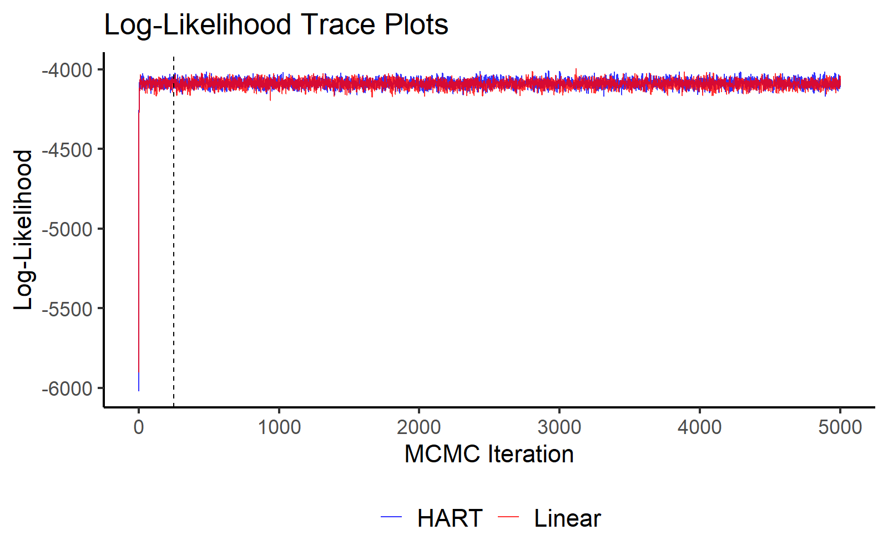
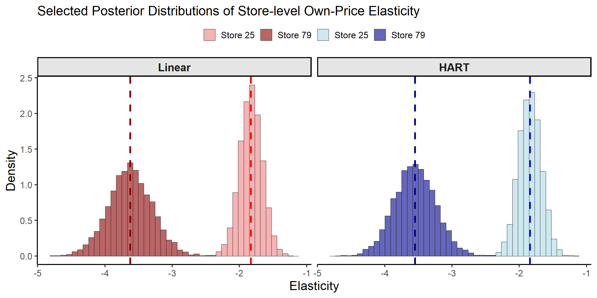
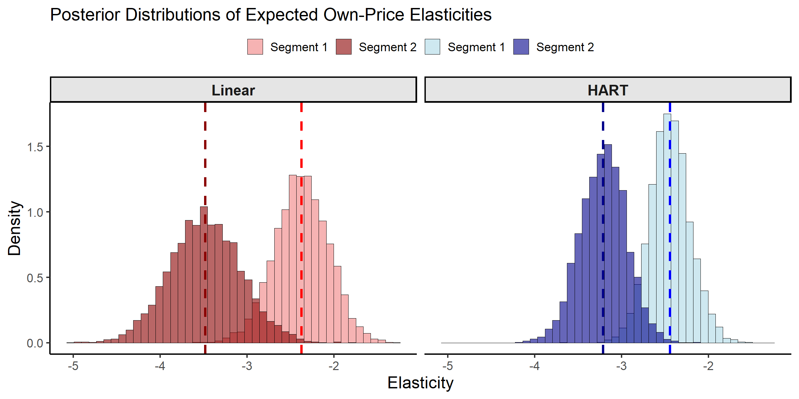

## Introduction
  
This vignette estimates a hierarchical linear model with HART priors using the `bayesm.HART` package, applied to the `orangeJuice` scanner panel dataset from `bayesm`. The HART prior specifies the *representative store* as a flexible, non-parametric function of observed store demographics via a sum-of-trees model $\Delta(Z_i)$, in contrast to the conventional linear specification $\Delta^\top Z_i$.

## Orange Juice Scanner Panel Data

The `orangeJuice` dataset contains weekly store-level scanner data for 83 stores. We observe log-sales, prices of 11 brands, and deal/feature indicators. Store demographics (income, education, ethnicity, household size, etc.) serve as covariates $Z_i$. Following Montgomery (1997), we estimate a log-log demand model for brand 1 (Tropicana Premium 64 oz), so coefficients are directly interpretable as price elasticities.


```r
# Load dependencies
library(bayesm.HART)
library(bayesm)
#> 
#> Attaching package: 'bayesm'
#> The following objects are masked from 'package:bayesm.HART':
#> 
#>     rhierLinearMixture, rhierMnlRwMixture, rhierNegbinRw
# Data wrangling and plotting utilities
library(tidyr)
library(dplyr)
#> 
#> Attaching package: 'dplyr'
#> The following objects are masked from 'package:stats':
#> 
#>     filter, lag
#> The following objects are masked from 'package:base':
#> 
#>     intersect, setdiff, setequal, union
library(ggplot2)

# Load orange juice scanner panel data
data(orangeJuice)
yx <- orangeJuice[["yx"]]
storedemo <- orangeJuice[["storedemo"]]

# Subset to brand 1 (Tropicana)
brand1 <- yx[yx[["brand"]] == 1, ]

# Build per-store regdata (following bayesm::orangeJuice documentation)
store_ids <- storedemo[["STORE"]]
nreg <- length(store_ids)
regdata <- vector("list", length = nreg)
price_cols <- paste0("price", 1:11)
for (i in 1:nreg) {
  si <- brand1[brand1[["store"]] == store_ids[i], ]
  y <- si[["logmove"]]
  X <- cbind(1, log(as.matrix(si[, price_cols])), si[["deal"]], si[["feat"]])
  colnames(X) <- c("Intercept", paste0("Log Price ", 1:11), "Deal", "Feature")
  regdata[[i]] <- list(y = y, X = X)
}

# Store-level demographics as Z (omit STORE id column, de-mean)
Z <- as.matrix(storedemo[, -1])
Z <- t(t(Z) - colMeans(Z)) # de-mean covariates as required by bayesm

# Final data object
Data <- list(regdata = regdata, Z = Z)
```

## MCMC Estimation

We fit both the HART model (Wiemann, 2025) and a conventional linear hierarchical model (Rossi et al., 2009). Both estimate store-specific coefficients $\beta_i$ via a hierarchical linear model; they differ only in their specification of $\Delta(\cdot)$. A short chain of 5000 iterations is used here for illustration; longer chains should be run in practice.


```r
# MCMC parameters
R <- 5000
burn <- 250
keep <- 1
Mcmc <- list(R = R, keep = keep)

out_hart <- bayesm.HART::rhierLinearMixture(
  Data = Data, Mcmc = Mcmc,
  Prior = list(
    ncomp = 1,
    bart = list(num_trees = 20) # new HART prior parameters
  )
)

out_lin <- bayesm.HART::rhierLinearMixture(
  Data = Data, Mcmc = Mcmc,
  Prior = list(ncomp = 1)
)
```

We check convergence by plotting the log-likelihood over MCMC iterations.


```r
burnin_draws <- ceiling(burn / keep) 

mcmc_data <- data.frame(
  Iteration = (1:length(out_hart$loglike)) * keep,
  HART = out_hart$loglike,
  Linear = out_lin$loglike
) %>% 
  pivot_longer(cols = c("HART", "Linear"), names_to = "Model", values_to = "LogLikelihood")

ggplot(mcmc_data, aes(x = Iteration, y = LogLikelihood, color = Model)) +
  geom_line(alpha = 0.8) +
  geom_vline(xintercept = burn, linetype = "dashed", color = "black") +
  scale_color_manual(values = c("HART" = "blue", "Linear" = "red")) +
  theme_classic(base_size = 16) +
  labs(title = "Log-Likelihood Trace Plots", x = "MCMC Iteration", y = "Log-Likelihood") +
  theme(legend.title = element_blank(), 
        legend.position = "bottom",
        legend.text = element_text(size = 16))
```

<div class="figure" style="text-align: center">

<p class="caption">MCMC Traceplot of the Log Likelihood.</p>
</div>


## Posterior Inference about Store-level Coefficients

We compare posterior distributions of the own-price elasticity for two stores: Store 25 (high-income, highly educated area) and Store 79 (lower-income, high ethnic diversity).


```r
selected_stores <- c(25, 79)
coef_indx <- 2 # "Log Price 1" = own-price elasticity
coef_name <- "Own-Price Elasticity"

# Create a combined factor for filling histograms
beta_draws <- bind_rows(
  as.data.frame(t(out_hart$betadraw[selected_stores, coef_indx, -c(1:burnin_draws)])) %>% 
    mutate(Model = "HART", Draw = row_number()),
  as.data.frame(t(out_lin$betadraw[selected_stores, coef_indx, -c(1:burnin_draws)])) %>% 
    mutate(Model = "Linear", Draw = row_number())
)
colnames(beta_draws)[1:2] <- paste("Store", selected_stores)

beta_draws_long <- beta_draws %>%
  pivot_longer(
    cols = starts_with("Store"), 
    names_to = "Store", 
    values_to = "Coefficient"
  ) %>% 
  mutate(
      Model = factor(Model, levels = c("Linear", "HART")), # Control facet order
      Group = interaction(Store, Model)
  )

# Define colors
model_fills <- c(
    "Store 25.Linear" = "lightcoral", "Store 79.Linear" = "darkred",
    "Store 25.HART" = "lightblue", "Store 79.HART" = "darkblue"
)
model_colors <- c(
    "Store 25.Linear" = "red", "Store 79.Linear" = "darkred",
    "Store 25.HART" = "blue", "Store 79.HART" = "darkblue"
)

# Calculate means
means <- beta_draws_long %>%
  group_by(Group, Model) %>%
  summarise(mean_val = mean(Coefficient), .groups = "drop")

ggplot(beta_draws_long, aes(x = Coefficient, fill = Group)) +
  geom_histogram(aes(y = after_stat(density)), alpha = 0.6, bins = 45, 
                 position = "identity", color = "black", linewidth = 0.3) +
  geom_vline(data = means, aes(xintercept = mean_val, color = Group),
             linetype = "dashed", linewidth = 1.2) +
  facet_wrap(~Model) +
  scale_fill_manual(name = "Store", values = model_fills,
                    breaks = c("Store 25.Linear", "Store 79.Linear", 
                               "Store 25.HART", "Store 79.HART"),
                    labels = c("Store 25", "Store 79", 
                               "Store 25", "Store 79")) +
  scale_color_manual(values = model_colors, guide = "none") +
  theme_classic(base_size = 16) +
  theme(axis.title = element_text(size = 18), legend.position = "top",
        legend.title = element_blank(),
        strip.text = element_text(size = 16, face = "bold"),
        strip.background = element_rect(fill = "grey90", color = "black")) +
    labs(title = paste("Selected Posterior Distributions of Store-level", coef_name),
    x = "Elasticity", y = "Density")
```

<div class="figure" style="text-align: center">

<p class="caption">Posterior Distributions of Store-level Own-Price Elasticities.</p>
</div>


```r
# Extract posterior draws for the selected stores and coefficient
hart_draws_25 <- out_hart$betadraw[25, coef_indx, -c(1:burnin_draws)]
hart_draws_79 <- out_hart$betadraw[79, coef_indx, -c(1:burnin_draws)]
lin_draws_25 <- out_lin$betadraw[25, coef_indx, -c(1:burnin_draws)]
lin_draws_79 <- out_lin$betadraw[79, coef_indx, -c(1:burnin_draws)]

# Create summary table
summary_results <- data.frame(
  Model = c("Linear", "Linear", "HART", "HART"),
  Store = c("25", "79", "25", "79"),
  Mean = c(mean(lin_draws_25), mean(lin_draws_79), 
           mean(hart_draws_25), mean(hart_draws_79)),
  SD = c(sd(lin_draws_25), sd(lin_draws_79), 
         sd(hart_draws_25), sd(hart_draws_79))
)

print(summary_results, digits = 3)
#>    Model Store  Mean    SD
#> 1 Linear    25 -1.83 0.169
#> 2 Linear    79 -3.62 0.327
#> 3   HART    25 -1.84 0.169
#> 4   HART    79 -3.55 0.312
```

Both models produce similar individual-level elasticity estimates. With approximately 117 weekly observations per store, the individual-level posterior is dominated by each store's own data rather than the hierarchical prior.

## Posterior Inference on Store Segment Coefficients

The models differ in how they characterize the expected coefficient $\Delta(Z)$ for a representative store with demographics $Z$. We compare these segment-level predictions for the same two stores, using the `predict` function.


```r
# We predict for all stores
DeltaZ_hat_hart <- predict(out_hart, newdata = Data, type = "DeltaZ+mu", burn = burn)
DeltaZ_hat_lin <- predict(out_lin, newdata = Data, type = "DeltaZ+mu", burn = burn)
```


```r
deltaZ_draws <- bind_rows(
  as.data.frame(t(DeltaZ_hat_hart[selected_stores, coef_indx, ])) %>% 
    mutate(Model = "HART", Draw = row_number()),
  as.data.frame(t(DeltaZ_hat_lin[selected_stores, coef_indx, ])) %>% 
    mutate(Model = "Linear", Draw = row_number())
)
colnames(deltaZ_draws)[1:2] <- c("Segment 1", "Segment 2")

deltaZ_draws_long <- deltaZ_draws %>%
  pivot_longer(
    cols = starts_with("Segment"), 
    names_to = "Store_Segment", 
    values_to = "Coefficient"
  ) %>% 
  mutate(
      Model = factor(Model, levels = c("Linear", "HART")), # Control facet order
      Group = interaction(Store_Segment, Model)
  )
  
# Update color definitions to match segment terminology
model_fills <- c(
    "Segment 1.Linear" = "lightcoral", "Segment 2.Linear" = "darkred",
    "Segment 1.HART" = "lightblue", "Segment 2.HART" = "darkblue"
)
model_colors <- c(
    "Segment 1.Linear" = "red", "Segment 2.Linear" = "darkred",
    "Segment 1.HART" = "blue", "Segment 2.HART" = "darkblue"
)

# Calculate means
means_deltaZ <- deltaZ_draws_long %>%
  group_by(Group, Model) %>%
  summarise(mean_val = mean(Coefficient), .groups = "drop")

ggplot(deltaZ_draws_long, aes(x = Coefficient, fill = Group)) +
  geom_histogram(aes(y = after_stat(density)), alpha = 0.6, bins = 45, 
                 position = "identity", color = "black", linewidth = 0.3) +
  geom_vline(data = means_deltaZ, aes(xintercept = mean_val, color = Group),
             linetype = "dashed", linewidth = 1.2) +
  facet_wrap(~Model) +
  scale_fill_manual(name = "Store Segment", values = model_fills,
                    breaks = c("Segment 1.Linear", "Segment 2.Linear", 
                               "Segment 1.HART", "Segment 2.HART"),
                    labels = c("Segment 1", "Segment 2", 
                               "Segment 1", "Segment 2")) +
  scale_color_manual(values = model_colors, guide = "none") +
  theme_classic(base_size = 16) +
  theme(axis.title = element_text(size = 18), legend.position = "top",
        legend.title = element_blank(),
        strip.text = element_text(size = 16, face = "bold"),
        strip.background = element_rect(fill = "grey90", color = "black")) +
         labs(title = "Posterior Distributions of Expected Own-Price Elasticities",
     x = "Elasticity", y = "Density")
```

<div class="figure" style="text-align: center">

<p class="caption">Posterior Distributions of Expected Store Segment Coefficients.</p>
</div>


```r
# Extract expected coefficients for the two segments
deltaZ_summary <- data.frame(
  Segment = c("Segment 1 (High Income, High Education)", 
              "Segment 2 (Low Income, High Ethnic Diversity)"),
  Linear_Mean = c(mean(DeltaZ_hat_lin[25, coef_indx, ]), 
                  mean(DeltaZ_hat_lin[79, coef_indx, ])),
  Linear_SD = c(sd(DeltaZ_hat_lin[25, coef_indx, ]), 
                sd(DeltaZ_hat_lin[79, coef_indx, ])),
  HART_Mean = c(mean(DeltaZ_hat_hart[25, coef_indx, ]), 
                mean(DeltaZ_hat_hart[79, coef_indx, ])),
  HART_SD = c(sd(DeltaZ_hat_hart[25, coef_indx, ]), 
              sd(DeltaZ_hat_hart[79, coef_indx, ]))
)

print(deltaZ_summary, digits = 3)
#>                                         Segment Linear_Mean Linear_SD HART_Mean
#> 1       Segment 1 (High Income, High Education)       -2.37     0.313     -2.44
#> 2 Segment 2 (Low Income, High Ethnic Diversity)       -3.48     0.414     -3.21
#>   HART_SD
#> 1   0.233
#> 2   0.268

# Calculate differences between segments
cat("\nDifferences between segments:\n")
#> 
#> Differences between segments:
cat("Linear approach difference:", 
    deltaZ_summary$Linear_Mean[2] - deltaZ_summary$Linear_Mean[1], "\n")
#> Linear approach difference: -1.109251
cat("HART approach difference:", 
    deltaZ_summary$HART_Mean[2] - deltaZ_summary$HART_Mean[1], "\n")
#> HART approach difference: -0.7700829
```

The linear approach is constrained to a linear function of demographics, while the HART model can capture nonlinearities and interactions in how store characteristics relate to price sensitivity.

## References

Montgomery, Alan L. (1997). "Creating Micro-Marketing Pricing Strategies Using Supermarket Scanner Data." Marketing Science 16(4), pp. 315--337.

Rossi, Peter E., Greg M. Allenby, and Robert McCulloch (2009). Bayesian Statistics and Marketing. Reprint. Wiley Series in Probability and Statistics. Chichester: Wiley.

Wiemann, Thomas (2025). "[Personalization with HART](https://thomaswiemann.com/assets/pdfs/jmp_wiemann.pdf)." Working paper.

    
