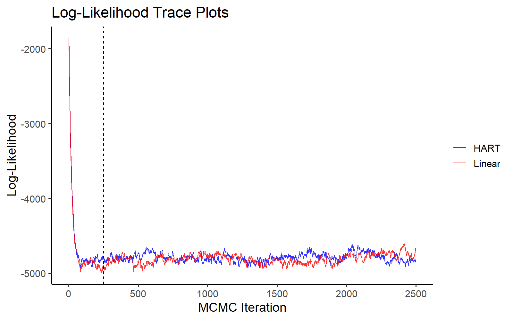
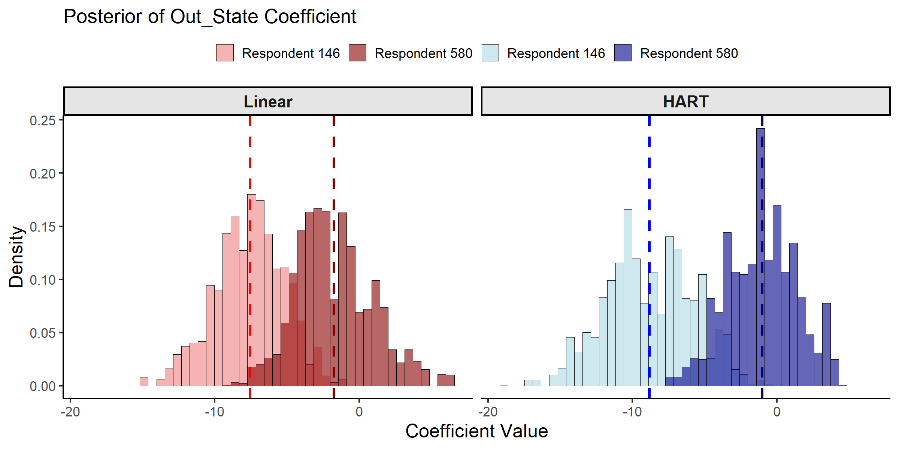
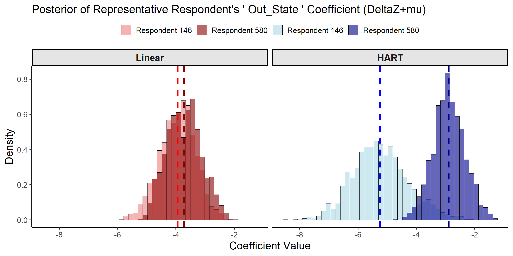

## Introduction
  
This vignette illustrates how to estimate a hierarchical logit model with HART priors using the `bayesm.HART` package. Following Application I in Wiemann (2025), the HART logit model is applied to the `bank` conjoint dataset of Allenby and Ginter (1995) on out-of-state credit card design.

The key feature of the `bayesm.HART` package is the use of a Hierarchical Additive Regression Tree (HART) prior. This allows for a flexible, non-parametric specification of the *representative consumer* as a function of observed characteristics. This vignette contrasts the HART logit model with a conventional hierarchical logit model that specifies the representative consumer as a linear function of characteristics.

The rest of the vignette proceeds as follows:
1. Load and prepare data for use with `bayesm` and `bayesm.HART`
2. Run MCMC chains for fully Bayesian inference
3. Posterior inference on respondent-level part-worths
4. Posterior inference on consumer segment part-worths

## Conjoint Data of Allenby and Ginter (1995)

To illustrate the HART logit model, we load the `bank` dataset included with the `bayesm` package and originally considered in Allenby and Ginter (1995). The dataset contains responses from 946 customers of a regional bank collected in a telephone conjoint on credit card attributes. The bank's main motivation stemmed from an effort to expand to customers in a new market ("out-of-state"). Each respondent offered between 13 and 17 responses to hypothetical choices between two credit cards that were identical in all considered attributes except for two that varied. In total, the dataset contains 14,799 binary responses as well as the respondents' age, income, and gender.

The code snippet below prepares the data for use with `bayesm` and `bayesm.HART`. Both packages take the same data structure, allowing researchers familiar with the `bayesm` package to get started quickly.

```r
# Load dependencies
library(bayesm.HART)
library(bayesm)
# Data wrangling and plotting utilities
library(tidyr)
library(dplyr)
library(ggplot2)

# Load and prepare data from the 'bank' dataset (same as bayesm)
data(bank)
choiceAtt <- bank$choiceAtt
hh <- levels(factor(choiceAtt$id))
nhh <- length(hh)
lgtdata <- vector("list", length = nhh)
for (i in 1:nhh) {
    y = 2 - choiceAtt[choiceAtt[,1]==hh[i], 2]
    nobs = length(y)
    X_temp = as.matrix(choiceAtt[choiceAtt[,1]==hh[i], c(3:16)])
    X = matrix(0, nrow = nrow(X_temp) * 2, ncol = ncol(X_temp))
    X[seq(1, nrow(X), by = 2), ] = X_temp
    lgtdata[[i]] = list(y=y, X=X)
}
Z <- as.matrix(bank$demo[, -1]) # omit id
Z <- t(t(Z) - colMeans(Z)) # de-mean covariates as required by bayesm

# Final data object (same as bayesm)
Data <- list(lgtdata = lgtdata, Z = Z, p = 2)
```

## MCMC Estimation

We apply two demand models to the conjoint data: the HART logit model proposed by Wiemann (2025) and a conventional linear hierarchical logit model (e.g., Rossi et al., 2009). Both models are motivated by a latent utility model of consumer choice, where each respondent chooses the credit card profile that maximizes their utility. The only difference between the HART and linear hierarchical specifications is their model of preference heterogeneity. The linear approach models the relationship between a respondent's characteristics as a linear function $\Delta^\top Z_i$ while the HART model uses a sum-of-trees factor model $\Delta(Z_i)$ that allows for rich nonlinearities and interactions.

The code snippet below specifies the MCMC hyperparameters. To speed up the code runtime, a short MCMC chain with only 5000 iterations is considered. Longer chains should be run in practice. We then sample from the posterior distribution of both models by calling `rhierMnlRwMixture`. The only difference in syntax is the additional prior argument `bart`. For simplicity, the code below specifies a HART model with only 20 trees per factor, leaving all other hyperparameters at their defaults. See also `?rhierMnlRwMixture` for details. 


A simple way to check for convergence is to plot the log-likelihood over MCMC iterations. The plot below indicates convergence of both MCMC chains within just a few iterations.


```r
burnin_draws <- ceiling(burn / keep) 

mcmc_data <- data.frame(
  Iteration = (1:length(out_hart$loglike)) * keep,
  HART = out_hart$loglike,
  Linear = out_lin$loglike
) %>% 
  pivot_longer(cols = c("HART", "Linear"), names_to = "Model", values_to = "LogLikelihood")

ggplot(mcmc_data, aes(x = Iteration, y = LogLikelihood, color = Model)) +
  geom_line(alpha = 0.8) +
  geom_vline(xintercept = burn, linetype = "dashed", color = "black") +
  scale_color_manual(values = c("HART" = "blue", "Linear" = "red")) +
  theme_classic(base_size = 16) +
  labs(title = "Log-Likelihood Trace Plots", x = "MCMC Iteration", y = "Log-Likelihood") +
  theme(legend.title = element_blank(), 
        legend.position = "bottom",
        legend.text = element_text(size = 16))
```

<div class="figure" style="text-align: center">

<p class="caption">MCMC Traceplot of the Log Likelihood.</p>
</div>


## Posterior Inference about Respondent-level Part-Worths

With the MCMC draws from both models, we can characterize the posterior estimates for individual-level coefficients, or part-worths. These coefficients represent respondent-specific preferences for each credit card attribute. To illustrate the differences between the HART and linear hierarchical approaches, we examine the posterior distributions for two respondents: Respondent 146 is an older woman with low income, while respondent 580 is a middle-aged man with moderate income. The comparison focuses on the out-of-state bank attribute, which represents a key design challenge for the bank's expansion strategy.


```r
selected_resp <- c(146, 580)
coef_indx <- 10 # "Interest" coefficient
coef_name <- colnames(bank$choiceAtt[, 3:16])[coef_indx]

# Create a combined factor for filling histograms
beta_draws <- bind_rows(
  as.data.frame(t(out_hart$betadraw[selected_resp, coef_indx, -c(1:burnin_draws)])) %>% 
    mutate(Model = "HART", Draw = row_number()),
  as.data.frame(t(out_lin$betadraw[selected_resp, coef_indx, -c(1:burnin_draws)])) %>% 
    mutate(Model = "Linear", Draw = row_number())
)
colnames(beta_draws)[1:2] <- paste("Respondent", selected_resp)

beta_draws_long <- beta_draws %>%
  pivot_longer(
    cols = starts_with("Respondent"), 
    names_to = "Respondent", 
    values_to = "Coefficient"
  ) %>% 
  mutate(
      Model = factor(Model, levels = c("Linear", "HART")), # Control facet order
      Group = interaction(Respondent, Model)
  )

# Define colors
model_fills <- c(
    "Respondent 146.Linear" = "lightcoral", "Respondent 580.Linear" = "darkred",
    "Respondent 146.HART" = "lightblue", "Respondent 580.HART" = "darkblue"
)
model_colors <- c(
    "Respondent 146.Linear" = "red", "Respondent 580.Linear" = "darkred",
    "Respondent 146.HART" = "blue", "Respondent 580.HART" = "darkblue"
)

# Calculate means
means <- beta_draws_long %>%
  group_by(Group, Model) %>%
  summarise(mean_val = mean(Coefficient), .groups = "drop")

ggplot(beta_draws_long, aes(x = Coefficient, fill = Group)) +
  geom_histogram(aes(y = after_stat(density)), alpha = 0.6, bins = 45, 
                 position = "identity", color = "black", linewidth = 0.3) +
  geom_vline(data = means, aes(xintercept = mean_val, color = Group),
             linetype = "dashed", linewidth = 1.2) +
  facet_wrap(~Model) +
  scale_fill_manual(name = "Respondent", values = model_fills,
                    breaks = c("Respondent 146.Linear", "Respondent 580.Linear", 
                               "Respondent 146.HART", "Respondent 580.HART"),
                    labels = c("Respondent 146", "Respondent 580", 
                               "Respondent 146", "Respondent 580")) +
  scale_color_manual(values = model_colors, guide = "none") +
  theme_classic(base_size = 16) +
  theme(axis.title = element_text(size = 18), legend.position = "top",
        legend.title = element_blank(),
        strip.text = element_text(size = 16, face = "bold"),
        strip.background = element_rect(fill = "grey90", color = "black")) +
    labs(title = paste("Selected Posterior Distributions of Individual Out-of-State Part-Worths"),
    x = "Coefficient Value", y = "Density")
```

<div class="figure" style="text-align: center">

<p class="caption">Posterior Distributions of Individual-level Part-Worths.</p>
</div>


```r
# Extract posterior draws for the selected respondents and coefficient
hart_draws_146 <- out_hart$betadraw[146, coef_indx, -c(1:burnin_draws)]
hart_draws_580 <- out_hart$betadraw[580, coef_indx, -c(1:burnin_draws)]
lin_draws_146 <- out_lin$betadraw[146, coef_indx, -c(1:burnin_draws)]
lin_draws_580 <- out_lin$betadraw[580, coef_indx, -c(1:burnin_draws)]

# Create summary table
summary_results <- data.frame(
  Model = c("Linear", "Linear", "HART", "HART"),
  Respondent = c("146", "580", "146", "580"),
  Mean = c(mean(lin_draws_146), mean(lin_draws_580), 
           mean(hart_draws_146), mean(hart_draws_580)),
  SD = c(sd(lin_draws_146), sd(lin_draws_580), 
         sd(hart_draws_146), sd(hart_draws_580))
)

print(summary_results, digits = 3)
#>    Model Respondent   Mean   SD
#> 1 Linear        146 -7.293 2.88
#> 2 Linear        580 -1.432 2.52
#> 3   HART        146 -8.194 2.75
#> 4   HART        580 -0.511 2.72
```

The posterior distributions show that both models produce similar individual-level part-worth estimates for these two respondents. This similarity is expected and reflects a key feature of hierarchical models: when respondents have many choice profiles (as is the case here), their individual-level posterior estimates are primarily driven by their own choice data rather than the first-stage prior. Both respondents have between 13 and 17 choice profiles, providing substantial individual-level information that dominates the influence of the first-stage prior specification. 

The real differences between HART and linear hierarchical models emerge in settings with limited individual-level data, or when characterizing the representative consumer for new segments—precisely the scenario of central interest for the bank's expansion plans in Allenby and Ginter (1995). The next section explores these differences by examining the representative consumer estimates.

## Posterior Inference on Consumer Segment Part-Worths

As established in the previous section, the real differences between HART and linear hierarchical models emerge when characterizing the representative consumer for new segments—precisely the scenario of central interest for the bank's expansion plans. The model estimates how part-worths vary with demographics `Z`, where the term `Delta(Z)` represents the expected part-worth for a "representative" respondent with characteristics `Z`.

To illustrate these differences, we focus on two granularly-defined consumer segments. Segment 1 is defined as older female respondents with low income, while Segment 2 is defined as middle-aged male respondents with moderate income. These segments are selected because they allow for illustration of substantial differences between conventional linear and HART logit models. We can use the `predict` function to get the posterior draws for `Delta(Z)` for these selected segments.


```r
# We predict for all respondents
DeltaZ_hat_hart <- predict(out_hart, newdata = Data, type = "DeltaZ+mu", burn = burn)
#> Predicting coefficient 1 with BART model
#> Predicting coefficient 2 with BART model
#> Predicting coefficient 3 with BART model
#> Predicting coefficient 4 with BART model
#> Predicting coefficient 5 with BART model
#> Predicting coefficient 6 with BART model
#> Predicting coefficient 7 with BART model
#> Predicting coefficient 8 with BART model
#> Predicting coefficient 9 with BART model
#> Predicting coefficient 10 with BART model
#> Predicting coefficient 11 with BART model
#> Predicting coefficient 12 with BART model
#> Predicting coefficient 13 with BART model
#> Predicting coefficient 14 with BART model
class(out_lin) <- "rhierMnlRwMixture" # allows bayesm model to use bayesm.HART methods 
DeltaZ_hat_lin <- predict(out_lin, newdata = Data, type = "DeltaZ+mu", burn = burn)
```


```r
deltaZ_draws <- bind_rows(
  as.data.frame(t(DeltaZ_hat_hart[selected_resp, coef_indx, ])) %>% 
    mutate(Model = "HART", Draw = row_number()),
  as.data.frame(t(DeltaZ_hat_lin[selected_resp, coef_indx, ])) %>% 
    mutate(Model = "Linear", Draw = row_number())
)
colnames(deltaZ_draws)[1:2] <- c("Segment 1", "Segment 2")

deltaZ_draws_long <- deltaZ_draws %>%
  pivot_longer(
    cols = starts_with("Segment"), 
    names_to = "Consumer_Segment", 
    values_to = "Coefficient"
  ) %>% 
  mutate(
      Model = factor(Model, levels = c("Linear", "HART")), # Control facet order
      Group = interaction(Consumer_Segment, Model)
  )
  
# Update color definitions to match segment terminology
model_fills <- c(
    "Segment 1.Linear" = "lightcoral", "Segment 2.Linear" = "darkred",
    "Segment 1.HART" = "lightblue", "Segment 2.HART" = "darkblue"
)
model_colors <- c(
    "Segment 1.Linear" = "red", "Segment 2.Linear" = "darkred",
    "Segment 1.HART" = "blue", "Segment 2.HART" = "darkblue"
)

# Calculate means
means_deltaZ <- deltaZ_draws_long %>%
  group_by(Group, Model) %>%
  summarise(mean_val = mean(Coefficient), .groups = "drop")

ggplot(deltaZ_draws_long, aes(x = Coefficient, fill = Group)) +
  geom_histogram(aes(y = after_stat(density)), alpha = 0.6, bins = 45, 
                 position = "identity", color = "black", linewidth = 0.3) +
  geom_vline(data = means_deltaZ, aes(xintercept = mean_val, color = Group),
             linetype = "dashed", linewidth = 1.2) +
  facet_wrap(~Model) +
  scale_fill_manual(name = "Consumer Segment", values = model_fills,
                    breaks = c("Segment 1.Linear", "Segment 2.Linear", 
                               "Segment 1.HART", "Segment 2.HART"),
                    labels = c("Segment 1", "Segment 2", 
                               "Segment 1", "Segment 2")) +
  scale_color_manual(values = model_colors, guide = "none") +
  theme_classic(base_size = 16) +
  theme(axis.title = element_text(size = 18), legend.position = "top",
        legend.title = element_blank(),
        strip.text = element_text(size = 16, face = "bold"),
        strip.background = element_rect(fill = "grey90", color = "black")) +
         labs(title = "Posterior Distributions of Expected Out-of-State Part-Worths",
     x = "Coefficient Value", y = "Density")
```

<div class="figure" style="text-align: center">

<p class="caption">Posterior Distributions of Expected Part-Worths.</p>
</div>


```r
# Extract expected part-worths for the two segments
deltaZ_summary <- data.frame(
  Segment = c("Segment 1 (Older Women, Low Income)", 
              "Segment 2 (Middle-aged Men, Moderate Income)"),
  Linear_Mean = c(mean(DeltaZ_hat_lin[146, coef_indx, ]), 
                  mean(DeltaZ_hat_lin[580, coef_indx, ])),
  Linear_SD = c(sd(DeltaZ_hat_lin[146, coef_indx, ]), 
                sd(DeltaZ_hat_lin[580, coef_indx, ])),
  HART_Mean = c(mean(DeltaZ_hat_hart[146, coef_indx, ]), 
                mean(DeltaZ_hat_hart[580, coef_indx, ])),
  HART_SD = c(sd(DeltaZ_hat_hart[146, coef_indx, ]), 
              sd(DeltaZ_hat_hart[580, coef_indx, ]))
)

print(deltaZ_summary, digits = 3)
#>                                        Segment Linear_Mean Linear_SD
#> 1          Segment 1 (Older Women, Low Income)       -3.90     0.637
#> 2 Segment 2 (Middle-aged Men, Moderate Income)       -3.74     0.425
#>   HART_Mean HART_SD
#> 1     -5.38   0.976
#> 2     -2.86   0.624

# Calculate differences between segments
cat("\nDifferences between segments:\n")
#> 
#> Differences between segments:
cat("Linear approach difference:", 
    deltaZ_summary$Linear_Mean[2] - deltaZ_summary$Linear_Mean[1], "\n")
#> Linear approach difference: 0.1555552
cat("HART approach difference:", 
    deltaZ_summary$HART_Mean[2] - deltaZ_summary$HART_Mean[1], "\n")
#> HART approach difference: 2.520084
```

The posterior distributions reveal economically important differences between the HART and linear hierarchical approaches. The conventional linear approach finds only moderate differences in the expected part-worths between the two segments. In stark contrast, HART finds substantially different preferences for the two segments. Where the linear specification averages over any nonlinearities and interactions, the HART model captures richer heterogeneity. This enhanced ability to differentiate between consumer segments represents a key advantage of the HART approach when granular understanding of preference heterogeneity is required for targeting new market segments.

## References

Allenby, Greg M. and James L. Ginter (1995). “Using Extremes to Design Products and Segment Markets.” Journal of Marketing Research 32.4, pp. 392–403.

Rossi, Peter E., Greg M. Allenby, and Robert McCulloch (2009). Bayesian Statistics and Marketing. Reprint. Wiley Series in Probability and Statistics. Chichester: Wiley.

Wiemann, Thomas (2025). "[Personalization with HART](https://thomaswiemann.com/assets/pdfs/wiemann_jmp.pdf)." Working paper.

    
